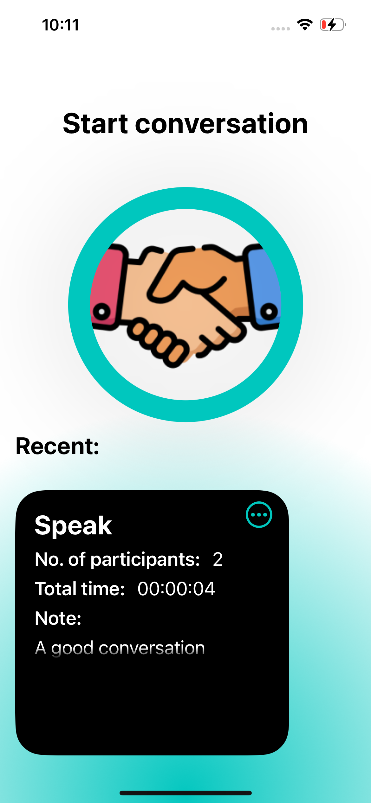
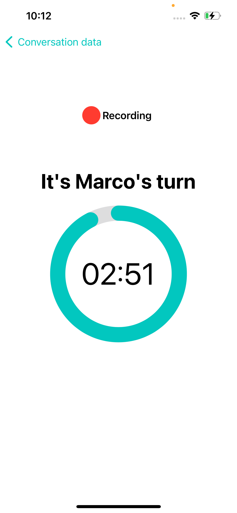
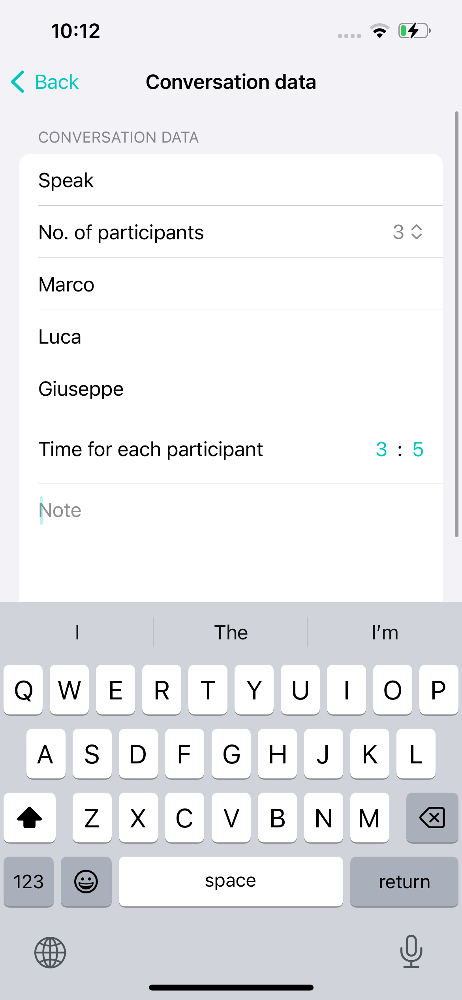

# Lemy Talk

## Overview

**Lemy Talk** is a unique app crafted for the **Swift Student Challenge 2024**. It’s designed to enable balanced, structured discussions with the help of timers and recording functionalities. Developed using Swift Playgrounds in Xcode, this app provides a platform where every participant is assured a fair chance to voice their thoughts without interruptions.

## Features

### User-Led Discussions

Set up a conversation by defining the number of participants and the specific duration each one has to speak.

### Timed Speaking Slots

Activate a discussion where the designated speaker is highlighted with a timer, ensuring no overlap of voices.

### Recording Conversations

Every session is recorded, allowing participants to replay discussions from the main home screen.

### Persistent Storage

Conversations are saved and accessible even after the app is closed, ensuring that no content is lost.

### Swift Playgrounds Development
Built entirely in Swift Playgrounds, this app showcases advanced utilization of timers and audio features in a mobile context.

## How It Works

1. **Create a Discussion:** 
   
   Input the number of participants and speaking duration for each.

2. **Begin the Discussion:**
   
   As the discussion starts, the app ensures that only the current speaker can talk as per the assigned time slot.

3. **Review & Reflect:**
   After all participants have spoken, the discussion is automatically saved for later access and review.

Lemy Talk is perfect for educational settings, debate practice, or any scenario requiring structured dialogue. Embrace effective communication with Lemy Talk!
